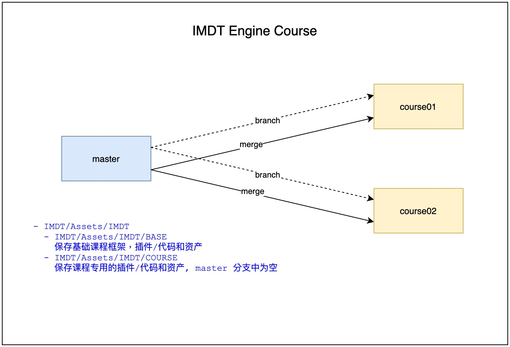

# Repo 说明

- 每个分支的 ./IMDT 目录为Unity 工程的根目录
- 在 ./IMDT/Assets/IMDT 所需的插件/代码和资产
  - ./IMDT/Assets/IMDT/BASE 
    - 基础课程框架；共用的插件、代码和资产
  - ./IMDT/Assets/IMDT/COURSE 
    - 每个课程专用的用插件、代码和资产

# 一般操作
- 各课程开发导师把内容 commit 与 push 到各自的 COURSE 分支，避免冲突
- COURSE 分支通过工蜂上的 Merge Request 同步 master 的框架 / 共用内容更新

# 分支